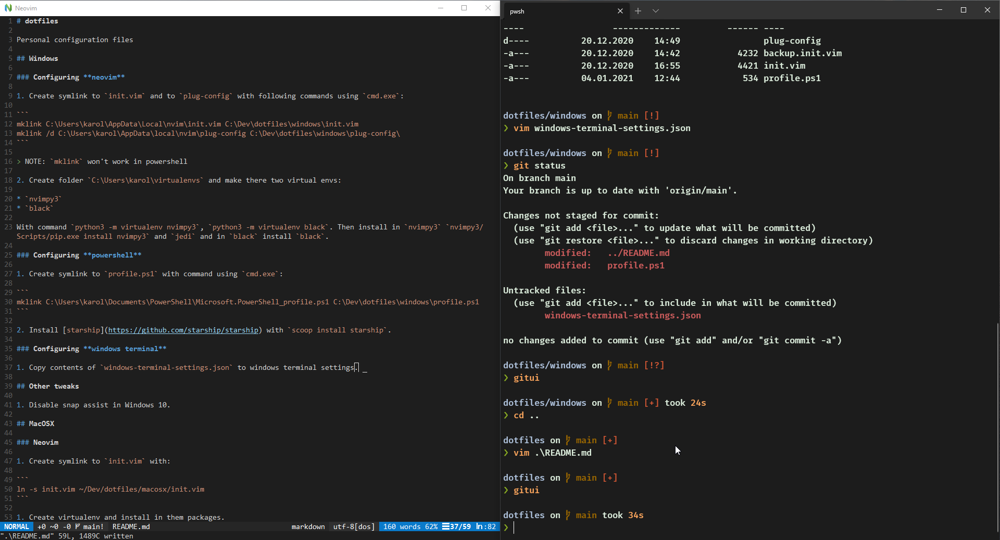

# dotfiles

Personal configuration files



## Windows

### Configuring **neovim**

1. Create symlink to `init.vim` and to `plug-config` with following commands using `cmd.exe`:

```
mklink C:\Users\karol\AppData\Local\nvim\init.vim C:\Dev\dotfiles\windows\init.vim
mklink /d C:\Users\karol\AppData\local\nvim\plug-config C:\Dev\dotfiles\windows\plug-config\
```

> NOTE: `mklink` won't work in powershell

2. Create folder `C:\Users\karol\virtualenvs` and make there two virtual envs:

* `nvimpy3`
* `black`

With command `python3 -m virtualenv nvimpy3`, `python3 -m virtualenv black`. Then install in `nvimpy3` `nvimpy3/Scripts/pip.exe install nvimpy3` and `jedi` and in `black` install `black`.

### Configuring **powershell**

1. Create symlink to `profile.ps1` with command using `cmd.exe`:

```
mklink C:\Users\karol\Documents\PowerShell\Microsoft.PowerShell_profile.ps1 C:\Dev\dotfiles\windows\profile.ps1
```

2. Install [starship](https://github.com/starship/starship) with `scoop install starship`.

### Configuring **windows terminal**

1. Copy contents of `windows-terminal-settings.json` to windows terminal settings.

## Other tweaks

1. Disable snap assist in Windows 10.

## MacOSX

### Neovim

1. Create symlink to `init.vim` with:

```
ln -s init.vim ~/Dev/dotfiles/macosx/init.vim
```

1. Create virtualenv and install in them packages.

### tmux

Create links in home directory to `.tmux` and to `.tmux.conf`.


